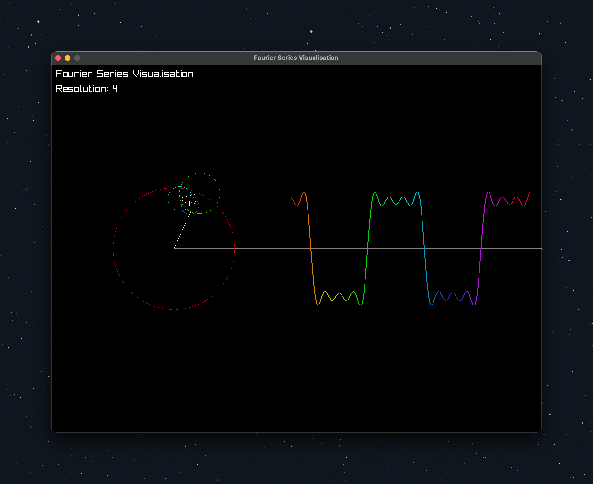

## Fourier Series Visualisation

This is a simple visualisation of the Fourier Series. It is a simple C++ Raylib code that uses the Fourier Series to draw a graph of a function.

## How to use

- Clone the repository with `git clone --recursive https://github.com/burakssen/fourier_series_visualiser.git`
- Run `mkdir build && cd build`
- Run `cmake ..`
- Run `make`
- Run `./fourier_series_visualiser`
- Enjoy!

## Controls

- `Space` to reverse the time
- `Arrow Up` to increase the resolution
- `Arrow Down` to decrease the resolution

## Screenshots

|  |  |
| ---------------------------------- | ---------------------------------- |
|  |  |
